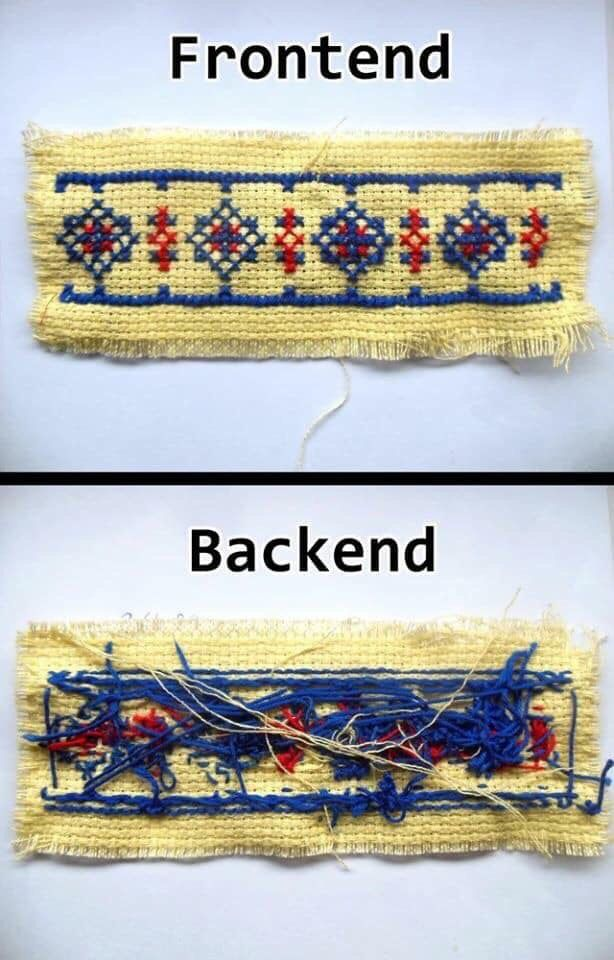

# Quick start to Web Development

<div style="text-align: right"><h2>  ~Prajwal Prashanth </h2></div>





## Frontend


* Download the repo https://github.com/prajwalprashanth/webdevseminar. To have a look at on what these three do.


## HTML : Hypertext Markup Language
```html
 <!Doctype html>
     <html>
     	<head>
            
         </head>
         <body>

         </body>
    </html>
```


## Let's talk about Elements, Tags

* Tags are enclosed by arrow marks.
* <xyz> : start tag
* </xyz> : end tag 
* A HTML element is a entity enclosed between the start and end tags.
* There are some tags without end tags called singleton tags( eg : br , img)


```html
<div>

  <p>
  	<h1></h1>
  </p>
  
  <br>
  
  <p>
  	<h1></h1>
  </p>
  
</div>
```


## Attributes

* All Elements have attributes, these attributes give extra meaning/information to a element.
* Attributes are name : value pair.
* Have to have space in between any two attributes (recommended).
* Values should be closed in quotes.


```html
<a href="google.com">Link to Google landing page</a>


<p text-align="right" >
    
</p>
```


## Special Attributes (Classes and ID)

* **Classes** : Classes are meant for a group of elements .
* **ID** : ID is meant for a unique element.
* There is no difference actually its like a notation  developers are following to differentiate.
* To refer a class a class you prefix it with a dot(.) .
* To refer a id you prefix with a hash(#) .
* Very useful while referring to style a elements/element or make some dynamic change using CSS and JS respectively.

```html
<div class="divisions">
    
</div>

<div class="divisions">
    
</div>


```

```css
.divisions
{
    color:blue;
}
#rcb_logo
{
    height:500px;
    widht:750px;
}
```


## Debugging, live edits 

Let's look at a important tool that is present in the browser itself which will be very usefull


## HTML Forms

* Forms are elements responsible for collecting user inputs from a webpage and sending to a webserver to either store that data or do some processing.


# _Lets code it Live_ 


* Go to w3schools.com (**Best documentation for web development and many more either to get started or to revise and refer**)
* While we're in w3schools lets have a look at what major changes happened in HTML 5 and other mentionable tags.
* HTML Entites
* Also lets look at how to style your webpages with CSS 


## Hands On Project

* Lets start with making your personnel website/ a online portfolio/ Resume
* Lets host it to internet too with Github Pages so you can share that link in future and moreover its free so why not make use of it.
* Head to github.com


## Responsive Web Page

* To make the Website experience easy and better for the user using in different screen sizes.
* Manually done using media queries .
* Also can use frameworks like Bootstrap, w3.css

## Javascript, Jquery

* For Dynamic web pages


For Preview/Demonstration lets have a look at one of my project : https://ieee-sjbit.github.io/


## Backend 

* PHP
* node.js
* Django........


* SQL
* MongoDB
* Postgresql.....


Lets look at my simple chat application . Using local server WAMP and coded in PHP


## Single Page Application


* Traditional example www.theschool.ai
* SPA example lets look at www.github.com itself


## Hot words/ Buzz words in Web Dev

* SPA
* Responsive
* SEO
* React
* Angular
* Django
* Full-stack
* Mobile first
* UI/ UX
* Wireframe
* AJAX
* JSON
* Wordpress


# How to proceed further?

* <h1>Learn by doing</h1>
  so complete the started online resume to your design your liking and all the information required .

* Refer other websites, other online portfolios, themes for design reference.

* Draw it on a paper to visualize the design first (for personal project), wireframe (in future) and then start making your web page like that.

* You're sure to hit a dead end don't worry w3schools.com, stackoverflow.com, google.com (CS community) is there to help you and 90% of the times someone would have gone through the same issue, have a look at the comments you'll get an answer.

* Check for tags, css styles, and other functionalities  in google once because most of the general things would have been already brainstormed by the creators and will be added built-in.

* Do projects upload to github, host them to have a online presence. Add a description of that project linkedin too and link to the code in github.

* Be on a look out web projects through personal links (friends, family, social circle) which will earn you experience and some cash. 

* Participate in online hackathons both competitions and hiring. eg hackereath

* Having some projects under the belt look out for internships. linkedin jobs , internshala , angellist.... 


# Thank you, Happy coding.

If you have Pen drives or External Hard drives, I can share some video tutorials.


https://linkedin.com/in/prajwalprashanth


## Git Command line Commands

#### First time when you have installed git to your PC

* git config --global user.name "**_your_username_**"
* git config --global user.email "**_your_email_id_**"

   
#### When a new repository is created and you want import the repo to your local machine
* git clone **_you_repository's_url_**

#### When you have made changes in the files of your local machine and want to sync it with online repo in github
* git add .
* git commit -m "**_your comments about the changes_**"
* git push

#### When you made changes in your github repo and want to bring those changes to local machine
* git pull

**NOTE these points**
* use cd command to change the directory(aka folders in your system) and necesarry path to go to your local repo before using these above commands 
* Don't Name any other repo in the format (your_username.github.io) as this repo is used to host your webpage
* the landing page should be index.html you can add other webpages to check them you should use the url (your_username.github.io/file_name.html)


